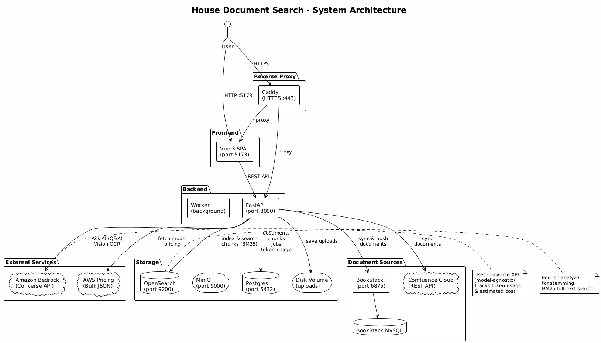
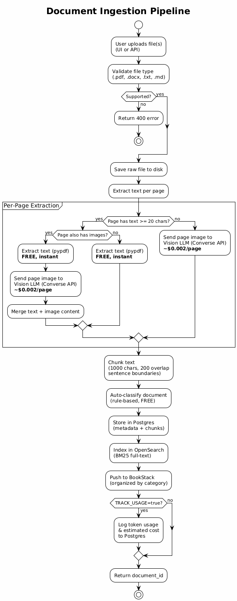
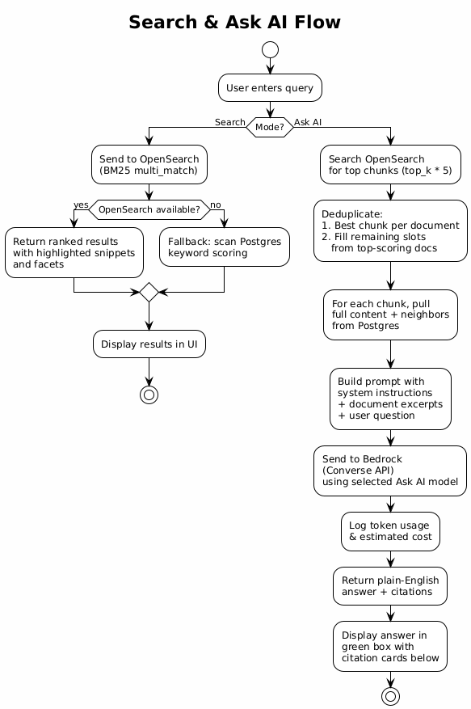
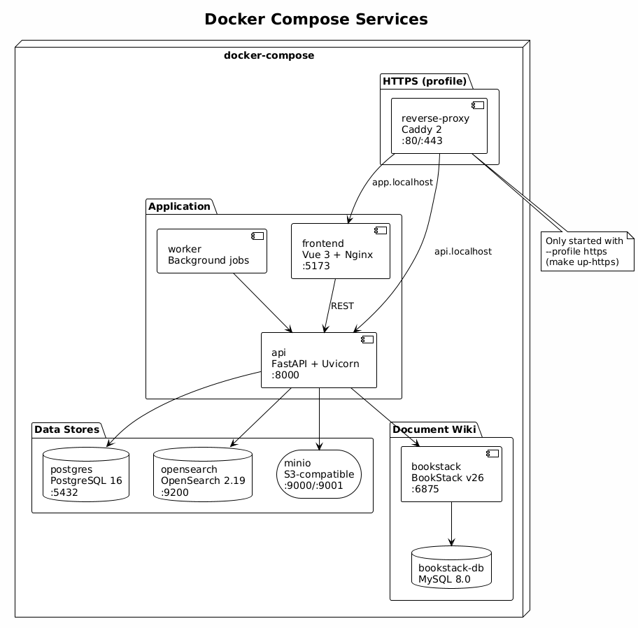
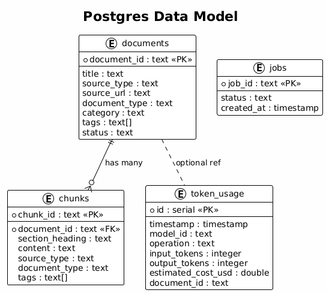

# House Document Search

This is a tool that helps you search through house-related documents like HOA rules, inspection reports, closing paperwork, insurance policies, and anything else that comes with buying or owning a home. Instead of digging through a pile of PDFs and Word docs trying to find that one paragraph about fence height limits or what the inspector said about the roof, you can upload your files and just search or ask questions in plain English. The app breaks your documents into smaller pieces, scores them for relevance, and gives you back the most useful snippets along with where they came from. Think of it like having a personal assistant who has actually read all your paperwork.

When you upload a document, the app automatically reads the content (including scanned pages using AI vision), figures out what kind of document it is (closing disclosure, HOA bylaws, appraisal, etc.), and files it into the right category. Documents are also pushed to BookStack (a local wiki) so you can browse and manage them there. You can also sync documents from Confluence Cloud when you are ready to move to the cloud.

## Architecture



## How to Use It

### Uploading Documents

1. Open the app in your browser at `http://localhost:5173` (or `https://app.localhost` if running with HTTPS)
2. Pick individual files or select an entire folder using the two file pickers
3. Click "Upload" and watch the live progress log as each file is extracted, classified, and indexed
4. Documents are automatically categorized (Closing Documents, HOA Governance, Insurance, etc.) and appear in the list at the bottom
5. Each document is also pushed to BookStack, organized by category

### Managing Documents

- Click the "x" button next to any document to delete it (removes from search index, database, and BookStack)
- Click "Clear All" to wipe everything and start fresh
- Documents are grouped by category with collapsible sections

### Searching

1. Make sure the "Search" toggle is selected (it is by default)
2. Type what you are looking for in the search bar, something like "rules about sheds" or "roof condition"
3. Hit Enter or click the Search button
4. Results show up below with the document name, type, relevance score, and a snippet of the matching text

### Asking Questions

1. Click the "Ask AI" toggle next to the search bar
2. Type a question like "What is the email address for my HOA?"
3. Hit Enter or click Ask
4. You will get a plain English answer powered by Amazon Bedrock along with citations showing exactly which documents the answer came from

### Settings

Click the "Settings" tab to access:

- **Service Health**: connectivity status and version info for all services (AWS, Postgres, OpenSearch, BookStack, Confluence)
- **Configuration**: select your Ask AI and Vision OCR models (with cost/speed labels), set AWS region, configure BookStack and Confluence credentials, toggle usage tracking
- **Token Usage & Cost**: track API calls, token counts, and estimated costs per model and per day. Pricing is pulled live from the AWS bulk pricing JSON

### How Documents Are Processed



When you upload a PDF, the app handles each page individually:

- Pages with text are read directly using pypdf (free, instant)
- Scanned pages with no text layer are sent to the selected Vision OCR model via Bedrock Converse API (costs about $0.002 per page)
- Pages with both text and images get both extracted and merged so nothing is missed

### How Search and Ask Work



### Syncing from BookStack

BookStack is a local wiki that runs alongside the app. When you upload through the app, documents are automatically organized in BookStack by category. You can also manage documents directly in BookStack and sync them back.

1. Open BookStack at `http://localhost:6875` (default login: `admin@admin.com` / `password`)
2. Create a book, add pages, and attach your PDFs
3. Generate an API token in your BookStack profile settings
4. Add the token to Settings > Configuration (or `infra/docker/compose/local.env`)
5. Sync: `curl -X POST http://localhost:8000/sources/bookstack/sync`

### Syncing from Confluence Cloud

When you are ready to move to Confluence Cloud, the connector is built and ready.

1. Sign up at https://www.atlassian.com/software/confluence (free tier works)
2. Create a space, upload your PDFs as page attachments
3. Generate an API token at https://id.atlassian.com/manage-profile/security/api-tokens
4. Add your site URL, email, and token to Settings > Configuration
5. Sync: `curl -X POST http://localhost:8000/sources/confluence/sync -H 'Content-Type: application/json' -d '{"space_keys":["YOUR_SPACE"]}'`

### Supported File Types

- PDF (.pdf) including scanned documents
- Word documents (.docx)
- Plain text (.txt)
- Markdown (.md)

## Running the App

There are three ways to run it: locally without containers, with Docker Compose over HTTP, or with Docker Compose over HTTPS. See [README-SETUP.md](README-SETUP.md) for full setup instructions.

Quick start with Docker:

```bash
make up
```

Or with HTTPS:

```bash
make certs
make up-https
```

Or locally without containers:

```bash
source .venv/bin/activate
make dev-all
```

## Docker Services



## Data Model



## API

The backend has a full REST API. Once running, visit `http://localhost:8000/docs` (or `https://api.localhost/docs` with HTTPS) for the interactive documentation.

Key endpoints:

- `POST /ingest/upload` - Upload a single document
- `POST /ingest/upload-bulk` - Upload multiple documents at once
- `POST /ingest/upload-stream` - Upload multiple files with live progress (SSE)
- `POST /search` - Search documents
- `POST /ask` - Ask a question and get an AI answer with citations
- `GET /documents` - List all documents
- `GET /documents/{id}` - Get a single document
- `GET /documents/{id}/chunks` - Get a document's text chunks
- `DELETE /documents/{id}` - Delete a document
- `DELETE /documents` - Delete all documents
- `POST /sources/bookstack/sync` - Sync from BookStack
- `POST /sources/confluence/sync` - Sync from Confluence Cloud
- `GET /admin/health-check` - Service health with versions
- `GET /admin/config` - Current configuration
- `PUT /admin/config` - Update configuration at runtime
- `GET /admin/models` - Available Bedrock models with labels
- `GET /admin/usage` - Token usage and cost summary
- `GET /admin/pricing` - Current Bedrock pricing for the region
- `GET /admin/jobs` - Background job status
- `POST /admin/reindex` - Trigger a reindex

## Testing

```bash
make test              # unit tests (no containers needed)
make test-integration  # integration tests (needs running containers)
make test-all          # everything
make test-coverage     # with coverage report
```

119 tests across 8 test files covering classification, extraction, schemas, services, API routes, BookStack client, Confluence client, and full HTTP/HTTPS integration.
