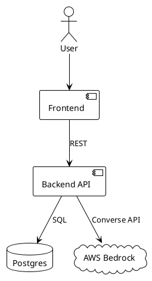
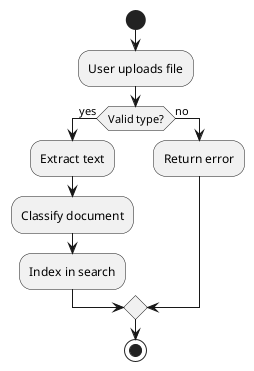
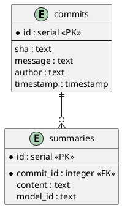
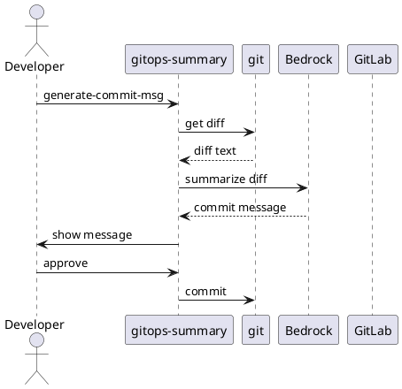

# Adding PlantUML Diagram Generation to gitops-summary

This documents how to add automated PlantUML diagram generation to a Python CLI tool. The approach was proven out in the house-document-search project and is ready to be adapted for gitops-summary.

## What PlantUML Does

PlantUML takes plain text descriptions and turns them into diagrams (architecture, sequence, ER, flow, etc). You write a `.puml` file that reads almost like pseudocode, and it renders a PNG or SVG. No drag-and-drop, no GUI, just text that lives in your repo and gets versioned with your code.

## Prerequisites

PlantUML is a Java application. You need:

1. **Java runtime** (headless is fine, no GUI needed)
2. **PlantUML JAR** (single file, ~10MB)

### Install on Ubuntu/Debian

```bash
sudo apt-get install -y default-jre-headless
wget -O /usr/local/lib/plantuml.jar \
  "https://github.com/plantuml/plantuml/releases/download/v1.2024.8/plantuml-1.2024.8.jar"
```

### Install on macOS

```bash
brew install plantuml
```

### Verify

```bash
JAVA_TOOL_OPTIONS="-Djava.awt.headless=true" java -jar /usr/local/lib/plantuml.jar -version
```

The `-Djava.awt.headless=true` flag is critical for CI/server environments with no display.

## How to Render Diagrams

### Single file

```bash
JAVA_TOOL_OPTIONS="-Djava.awt.headless=true" \
  java -jar /usr/local/lib/plantuml.jar -tpng diagram.puml
```

This produces `diagram.png` in the same directory.

### Batch render all .puml files in a directory

```bash
JAVA_TOOL_OPTIONS="-Djava.awt.headless=true" \
  java -jar /usr/local/lib/plantuml.jar -tpng "docs/diagrams/*.puml"
```

### Output formats

- `-tpng` (default, good for READMEs)
- `-tsvg` (scalable, good for docs sites)
- `-ttxt` (ASCII art, good for terminal output)

## PlantUML Syntax Quick Reference

### Architecture / Component Diagram



### Activity / Flow Diagram



### Entity Relationship Diagram



### Sequence Diagram (good for CLI workflows)



## Integration Pattern for a Python CLI

Here is how to wrap PlantUML rendering in Python, suitable for adding to gitops-summary as a module:

```python
"""plantuml.py - Render PlantUML diagrams from .puml files."""

import os
import subprocess
import shutil
from pathlib import Path

# Default locations to search for the PlantUML JAR
_JAR_SEARCH_PATHS = [
    "/usr/local/lib/plantuml.jar",
    os.path.expanduser("~/.local/lib/plantuml.jar"),
    # Add more as needed
]


def find_plantuml_jar() -> str | None:
    """Find the PlantUML JAR on the system."""
    # Check if 'plantuml' command exists (brew install)
    if shutil.which("plantuml"):
        return "plantuml"  # Use as a command, not a JAR
    for path in _JAR_SEARCH_PATHS:
        if os.path.isfile(path):
            return path
    return None


def render(
    input_path: str,
    output_format: str = "png",
    output_dir: str | None = None,
) -> str:
    """Render a .puml file to an image.

    Args:
        input_path: Path to the .puml file
        output_format: png, svg, or txt
        output_dir: Where to write output (default: same dir as input)

    Returns:
        Path to the rendered file

    Raises:
        RuntimeError: If PlantUML is not installed or rendering fails
    """
    jar = find_plantuml_jar()
    if not jar:
        raise RuntimeError(
            "PlantUML not found. Install with:\n"
            "  wget -O ~/.local/lib/plantuml.jar "
            "https://github.com/plantuml/plantuml/releases/download/v1.2024.8/plantuml-1.2024.8.jar"
        )

    env = {**os.environ, "JAVA_TOOL_OPTIONS": "-Djava.awt.headless=true"}

    cmd = (
        [jar, f"-t{output_format}"]
        if jar == "plantuml"
        else ["java", "-jar", jar, f"-t{output_format}"]
    )

    if output_dir:
        os.makedirs(output_dir, exist_ok=True)
        cmd.extend(["-o", os.path.abspath(output_dir)])

    cmd.append(input_path)

    result = subprocess.run(cmd, capture_output=True, text=True, env=env)
    if result.returncode != 0:
        raise RuntimeError(f"PlantUML failed: {result.stderr}")

    # Return the output path
    stem = Path(input_path).stem
    out_dir = output_dir or str(Path(input_path).parent)
    return os.path.join(out_dir, f"{stem}.{output_format}")


def render_all(
    directory: str,
    output_format: str = "png",
) -> list[str]:
    """Render all .puml files in a directory.

    Returns list of output file paths.
    """
    puml_files = sorted(Path(directory).glob("*.puml"))
    return [render(str(f), output_format) for f in puml_files]
```

### CLI integration (click example)

```python
import click
from .plantuml import render, render_all

@click.command()
@click.argument("path", type=click.Path(exists=True))
@click.option("--format", "fmt", default="png", type=click.Choice(["png", "svg", "txt"]))
def diagram(path, fmt):
    """Render PlantUML diagrams."""
    if os.path.isdir(path):
        outputs = render_all(path, fmt)
        for o in outputs:
            click.echo(f"  rendered: {o}")
    else:
        output = render(path, fmt)
        click.echo(f"  rendered: {output}")
```

## Makefile Target

```makefile
diagrams:
	JAVA_TOOL_OPTIONS="-Djava.awt.headless=true" \
	  java -jar /usr/local/lib/plantuml.jar -tpng docs/diagrams/*.puml
```

## CI/CD Integration

### GitHub Actions

```yaml
- name: Render diagrams
  run: |
    sudo apt-get install -y default-jre-headless
    wget -qO /tmp/plantuml.jar https://github.com/plantuml/plantuml/releases/download/v1.2024.8/plantuml-1.2024.8.jar
    JAVA_TOOL_OPTIONS="-Djava.awt.headless=true" java -jar /tmp/plantuml.jar -tpng docs/diagrams/*.puml
```

### GitLab CI

```yaml
render-diagrams:
  image: openjdk:11-jre-slim
  script:
    - wget -qO /tmp/plantuml.jar https://github.com/plantuml/plantuml/releases/download/v1.2024.8/plantuml-1.2024.8.jar
    - java -Djava.awt.headless=true -jar /tmp/plantuml.jar -tpng docs/diagrams/*.puml
  artifacts:
    paths:
      - docs/diagrams/*.png
```

## Key Gotchas

1. **Headless mode is required** on servers/CI. Without `-Djava.awt.headless=true`, PlantUML crashes trying to initialize a display.

2. **The JAR is self-contained**. No install step beyond downloading it. No package manager needed.

3. **PlantUML source files are just text**. They diff cleanly in git, unlike binary diagram files. Commit the `.puml` source and optionally the rendered `.png`.

4. **Theme support**. Use `!theme plain` for clean black-and-white diagrams that look good in both light and dark mode READMEs.

5. **Large diagrams**. If you hit size limits, set `PLANTUML_LIMIT_SIZE=8192` as an environment variable.


## Generating PlantUML from a Repo Using Bedrock

The real power for gitops-summary is not hand-writing `.puml` files but having Bedrock analyze a repo and generate the diagrams automatically. Here is the pattern.

### The Flow

```
repo analysis --> build prompt --> Bedrock Converse API --> .puml text --> render PNG
```

### Step 1: Gather Repo Context

Collect the information Bedrock needs to produce useful diagrams:

```python
"""repo_context.py - Gather repo structure and metadata for diagram generation."""

import subprocess
from pathlib import Path


def get_repo_context(repo_path: str) -> dict:
    """Collect repo info that Bedrock needs to generate diagrams."""

    # File tree (excluding noise)
    tree = subprocess.run(
        ["find", ".", "-type", "f",
         "-not", "-path", "*/.git/*",
         "-not", "-path", "*/__pycache__/*",
         "-not", "-path", "*/node_modules/*",
         "-not", "-path", "*/.venv/*"],
        capture_output=True, text=True, cwd=repo_path,
    ).stdout.strip()

    # Docker compose services (if any)
    compose_file = Path(repo_path) / "docker-compose.yml"
    compose = compose_file.read_text() if compose_file.exists() else ""
    # Also check common alternate locations
    for alt in ["infra/docker/compose/docker-compose.yml", "docker/docker-compose.yml"]:
        alt_path = Path(repo_path) / alt
        if alt_path.exists():
            compose = alt_path.read_text()
            break

    # Recent git log for understanding what the project does
    git_log = subprocess.run(
        ["git", "log", "--oneline", "-30"],
        capture_output=True, text=True, cwd=repo_path,
    ).stdout.strip()

    # README for project description
    readme = ""
    for name in ["README.md", "readme.md", "README.rst"]:
        readme_path = Path(repo_path) / name
        if readme_path.exists():
            readme = readme_path.read_text()[:3000]  # first 3000 chars
            break

    # Key config files
    configs = {}
    for pattern in ["Makefile", "pyproject.toml", "package.json", "Dockerfile", "Caddyfile"]:
        for f in Path(repo_path).rglob(pattern):
            rel = str(f.relative_to(repo_path))
            configs[rel] = f.read_text()[:2000]

    return {
        "file_tree": tree,
        "compose": compose,
        "git_log": git_log,
        "readme": readme,
        "configs": configs,
    }
```

### Step 2: Ask Bedrock to Generate PlantUML

```python
"""diagram_generator.py - Use Bedrock to generate PlantUML from repo context."""

import os
import boto3


def generate_diagram(
    context: dict,
    diagram_type: str = "architecture",
    model_id: str | None = None,
) -> str:
    """Ask Bedrock to generate a PlantUML diagram from repo context.

    Args:
        context: Output from get_repo_context()
        diagram_type: One of: architecture, sequence, flow, data_model, containers
        model_id: Bedrock model ID (defaults to Claude Haiku)

    Returns:
        PlantUML source text (the content between @startuml and @enduml)
    """
    model = model_id or os.getenv(
        "BEDROCK_MODEL_ID",
        "anthropic.claude-3-haiku-20240307-v1:0",
    )

    prompts = {
        "architecture": (
            "Generate a PlantUML component diagram showing the system architecture. "
            "Include all services, databases, external APIs, and how they connect. "
            "Use appropriate PlantUML elements: actor, component, database, cloud, storage."
        ),
        "sequence": (
            "Generate a PlantUML sequence diagram showing the main user workflow. "
            "Show the interaction between the user, frontend, backend, database, "
            "and any external services."
        ),
        "flow": (
            "Generate a PlantUML activity diagram showing the main data processing flow. "
            "Include decision points, parallel paths, and error handling."
        ),
        "data_model": (
            "Generate a PlantUML entity-relationship diagram showing the database schema. "
            "Include all tables, their columns with types, primary keys, and relationships."
        ),
        "containers": (
            "Generate a PlantUML diagram showing all Docker containers/services, "
            "their ports, volumes, and dependencies."
        ),
    }

    system_prompt = (
        "You are a software architect. You generate PlantUML diagrams from codebase context. "
        "Return ONLY the PlantUML source code, starting with @startuml and ending with @enduml. "
        "Use '!theme plain' for clean rendering. No explanation, no markdown fences, just the PlantUML."
    )

    # Build the context message
    parts = [f"Project README:\n{context['readme']}\n"]
    if context["file_tree"]:
        parts.append(f"File tree:\n{context['file_tree']}\n")
    if context["compose"]:
        parts.append(f"Docker Compose:\n{context['compose']}\n")
    if context["git_log"]:
        parts.append(f"Recent commits:\n{context['git_log']}\n")
    for name, content in context.get("configs", {}).items():
        parts.append(f"{name}:\n{content}\n")

    user_msg = (
        f"{prompts.get(diagram_type, prompts['architecture'])}\n\n"
        f"Here is the codebase context:\n\n{''.join(parts)}"
    )

    client = boto3.client(
        "bedrock-runtime",
        region_name=os.getenv("AWS_REGION", "us-east-1"),
    )

    resp = client.converse(
        modelId=model,
        system=[{"text": system_prompt}],
        messages=[{"role": "user", "content": [{"text": user_msg}]}],
        inferenceConfig={"maxTokens": 4096},
    )

    puml = resp["output"]["message"]["content"][0]["text"]

    # Clean up: ensure it starts and ends correctly
    if "@startuml" not in puml:
        puml = f"@startuml\n{puml}\n@enduml"

    return puml
```

### Step 3: Full Pipeline (Analyze, Generate, Render)

```python
"""generate_repo_diagrams.py - End-to-end: repo -> PlantUML -> PNG."""

import os
from pathlib import Path

from .repo_context import get_repo_context
from .diagram_generator import generate_diagram
from .plantuml import render


def generate_repo_diagrams(
    repo_path: str,
    output_dir: str = "docs/diagrams",
    diagram_types: list[str] | None = None,
) -> list[str]:
    """Analyze a repo and generate architecture diagrams.

    Args:
        repo_path: Path to the git repo
        output_dir: Where to write .puml and .png files
        diagram_types: Which diagrams to generate
            (default: architecture, containers, flow)

    Returns:
        List of rendered PNG file paths
    """
    types = diagram_types or ["architecture", "containers", "flow"]
    os.makedirs(output_dir, exist_ok=True)

    # Step 1: gather context
    context = get_repo_context(repo_path)

    outputs = []
    for dtype in types:
        # Step 2: generate PlantUML via Bedrock
        puml_source = generate_diagram(context, dtype)

        # Step 3: write .puml file
        puml_path = os.path.join(output_dir, f"{dtype}.puml")
        Path(puml_path).write_text(puml_source)

        # Step 4: render to PNG
        png_path = render(puml_path, output_format="png")
        outputs.append(png_path)
        print(f"  generated: {png_path}")

    return outputs
```

### Step 4: CLI Command for gitops-summary

```python
import click
from .generate_repo_diagrams import generate_repo_diagrams

@click.command()
@click.option("--repo", default=".", help="Path to the git repo")
@click.option("--output", default="docs/diagrams", help="Output directory")
@click.option(
    "--type", "types", multiple=True,
    default=["architecture", "containers", "flow"],
    type=click.Choice(["architecture", "sequence", "flow", "data_model", "containers"]),
    help="Diagram types to generate",
)
@click.option("--model", default=None, help="Bedrock model ID to use")
def diagrams(repo, output, types, model):
    """Generate architecture diagrams from the repo using AI."""
    click.echo(f"Analyzing {repo}...")
    outputs = generate_repo_diagrams(
        repo_path=repo,
        output_dir=output,
        diagram_types=list(types),
    )
    click.echo(f"Generated {len(outputs)} diagrams in {output}/")
```

### Usage

```bash
# Generate all default diagrams for the current repo
gitops-summary diagrams

# Generate specific diagram types
gitops-summary diagrams --type architecture --type data_model

# Use a specific model
gitops-summary diagrams --model anthropic.claude-sonnet-4-20250514-v1:0

# Different repo
gitops-summary diagrams --repo /path/to/other/repo --output /tmp/diagrams
```

### How It Works End-to-End

```
1. CLI runs `gitops-summary diagrams`
2. repo_context.py scans the repo:
   - file tree, docker-compose, git log, README, config files
3. diagram_generator.py sends context to Bedrock:
   - system prompt: "you are a software architect, return only PlantUML"
   - user prompt: diagram type instructions + repo context
4. Bedrock returns PlantUML source text
5. plantuml.py writes the .puml file and shells out to the PlantUML JAR
6. PlantUML JAR renders .puml -> .png
7. Both .puml (source) and .png (rendered) are saved to docs/diagrams/
```

The `.puml` files are committed to git so they can be diffed and regenerated. The `.png` files can be committed too or regenerated in CI.
