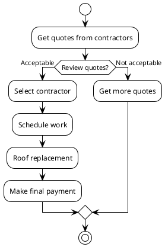

# Roof Replacement Project

## Project Overview

- Obtain multiple quotes from roofing contractors
- Review and compare quotes (materials, warranty, pricing)
- Select the best contractor
- Schedule roof replacement work 
- Complete payment after work is finished

<!-- notes: This is an overview of the full roof replacement process, from getting initial quotes to completing the final payment after work is done. -->

## Contractor Quotes 

### BRAX Roofing
- TPO flat roof system 
- 10-year workmanship warranty
- 10-year material warranty
- With parapet walls: $14,220
- Without parapet walls: $10,595

<!-- notes: BRAX proposed a TPO membrane roof with optional parapet walls to separate from neighboring roofs. Their warranties cover 10 years. -->

### All Day Roofing
- Multiple options: TPO 60mil, EPDM 75mil, EPDM 90mil
- 15-20 year, 20-30 year, or 30-50 year warranties
- Prices from $12,800 to $20,996

<!-- notes: All Day provided several flat roof options at different price points and warranty lengths up to 50 years. -->

### Virginia Roofing
- 60mil EPDM rubber roof
- Warranty terms not specified
- Price: Based on material costs at time of delivery

<!-- notes: Virginia Roofing proposed an EPDM rubber roof but did not provide set pricing or warranty details. -->

## Key Considerations

- Roof material and expected lifespan (TPO, EPDM, etc.)
- Warranty coverage period for labor and materials
- Optional additions like parapet walls
- Total project cost and payment schedule
- Contractor ratings and reviews

<!-- notes: The main factors to consider are the roofing material, warranty terms, any additional needs like parapet walls, total costs, and contractor reputation. -->

## Next Steps

- Review all quotes thoroughly 
- Check contractor references and ratings
- Select preferred contractor option
- Finalize contract and schedule work dates

<!-- notes: Next steps are to carefully evaluate all the options, verify contractor qualifications, select the best choice, and get the project scheduled. -->