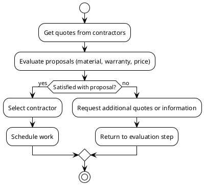

# Roof Replacement Options
- Patrick Flanagan's Residence
<!-- notes: Welcome everyone to this overview of roof replacement options for Patrick Flanagan's residence. -->

## Contractor Quotes
- BRAX Roofing
  - Proposed TPO roofing system
  - 10-year workmanship warranty
  - 10-year manufacturer material warranty
  - Price: $12,800.00
- All Day Roofing & More LLC
  - Proposed EPDM 75mil roofing system
  - 25-year manufacturer warranty
  - Price: $16,114.80
- Virginia Roofing Corporation
  - Proposed .060 black E.P.D.M. (rubber) membrane
  - Warranty details not provided
  - Price quote not provided (material pricing upon delivery)
<!-- notes: Here are the quotes received from the three contractors, along with their proposed materials and warranties. -->

## Workflow Diagram

<!-- notes: This diagram shows the decision process, from getting quotes to selecting a contractor and scheduling work. -->

## Timeline
- May 10, 2026: Received proposal from All Day Roofing & More LLC
- May 12, 2026: Received proposal from Virginia Roofing Corporation
- Date not specified: Received proposal from BRAX Roofing
- Decision pending: Selection of contractor and scheduling of work
<!-- notes: This timeline outlines the key dates in the roof replacement process so far. -->

## Additional Considerations
- HOA approval and neighbor coordination may be required (BRAX Roofing)
- Material pricing may change upon delivery (Virginia Roofing Corporation)
- Parapet wall option recommended by BRAX Roofing for long-term benefits
<!-- notes: These are additional factors to consider when making a decision on the roof replacement. -->

## Next Steps
- Review HOA requirements and coordinate with neighbors
- Request additional information or clarification from contractors, if needed
- Make a decision on the contractor and schedule work
<!-- notes: These are the next steps to move forward with the roof replacement project. -->