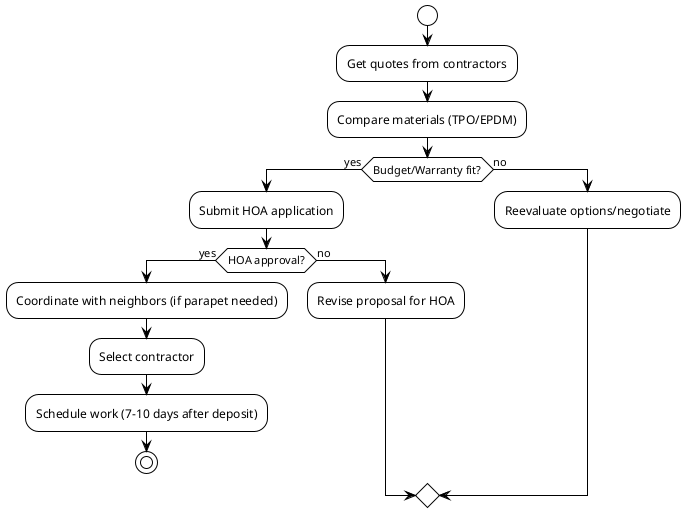

# Flat Roof Replacement Options for Patrick Flanagan
- 12133 Tribune Street, Fairfax, VA 22033-5528
<!-- notes: Welcome everyone. Today we’ll review roof replacement options, contractors, and key decision points. -->

## Key Contractors and Proposals
- **BRAX Roofing**
  - Option: TPO membrane with optional parapet walls
  - Price: $10,595 (roof only), $3,625 (parapet walls add-on)
  - Materials: 60mil TPO, 1” poly ISO insulation
- **All Day Roofing & More LLC**
  - Three options: TPO (15-20yr), EPDM 75mil (20-30yr), RubberGard 90mil (30-50yr)
  - Prices: $12,800 (TPO), $16,114.80 (EPDM 75mil), $20,996 (RubberGard 90mil)
  - Materials: Tapered slope board insulation, drip edge, flashing
- **American Home Contractors**
  - Option: Roof repairs with minor upgrades
  - Price: $2,850 (repairs only, not full replacement)
- **Virginia Roofing Corporation**
  - Option: EPDM roof recovery (overlay)
  - Price: Not specified (quote pending)
  - Materials: 0.60mil black EPDM, ½” HD insulation cover board
<!-- notes: Here’s an overview of contractors and their proposed materials. BRAX offers a modern TPO solution, while All Day Roofing provides multiple warranty tiers. -->

## Warranty Comparison
- **BRAX Roofing**
  - 10-year workmanship warranty
  - 10-year manufacturer material warranty (TPO)
- **All Day Roofing**
  - 15-50 year manufacturer warranties (varies by material)
  - No workmanship warranty specified
- **American Home Contractors**
  - No warranty details provided (repair-focused)
- **Virginia Roofing Corporation**
  - Standard manufacturer warranty expected (EPDM)
<!-- notes: Warranties vary significantly—BRAX and All Day Roofing offer long-term material coverage, while others focus on repairs. -->

## Parapet Wall Consideration
- Proposed by BRAX Roofing to separate shared roof systems
- Benefits:
  - Independent future maintenance
  - Cleaner waterproofing transitions
  - Reduced risk of tie-in failures
- Requires neighbor approval for integration
- Additional cost: $3,625
<!-- notes: Parapet walls offer long-term advantages but require coordination with neighbors and HOA. -->

<!-- notes: This diagram outlines the decision workflow, from quotes to approvals and scheduling. -->

## HOA and Neighbor Coordination
- **HOA Requirements**
  - Written approval required for exterior changes
  - Submit via "Exterior Modification Application" to Theoharis Management
  - ARB review timeline: Varies (typically 2-4 weeks)
- **Neighbor Coordination**
  - Parapet walls require neighbor consent
  - Shared roof modifications may impact adjacent properties
<!-- notes: HOA approval and neighbor coordination are critical steps—start early to avoid delays. -->

## Project Timeline
- **BRAX Roofing**
  - Deposit: 50% to order materials
  - Scheduling: 7-10 days after deposit (weather permitting)
- **All Day Roofing**
  - Deposit: 50% to initiate project
  - No timeline specified
- **American Home Contractors**
  - No deposit/timeline provided (repairs)
- **Virginia Roofing Corporation**
  - Terms: Payment due upon invoice receipt
<!-- notes: Timelines vary—BRAX and All Day Roofing require deposits, while repairs may start sooner. -->

## Summary of Recommendations
- **Best for longevity**: RubberGard 90mil (All Day Roofing)
- **Best value**: TPO (BRAX Roofing)
- **Minimal disruption**: EPDM overlay (Virginia Roofing)
- **Urgent repairs**: American Home Contractors ($2,850)
- Key considerations: Warranties, neighbor/HOA approvals, long-term costs
<!-- notes: Balance priorities—longevity vs. cost vs. minimal disruption. -->