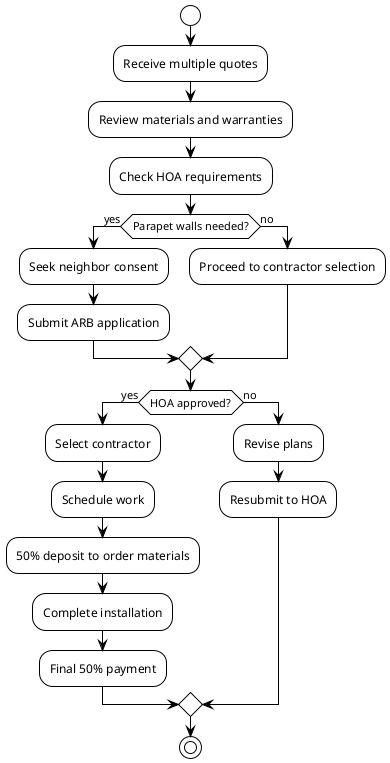

# Patrick Flanagan Roof Replacement Options
## Comparing quotes from BRAX Roofing, All Day Roofing & More LLC, Virginia Roofing Corporation, and American Home Contractors
<!-- notes: Introduction to the presentation covering the various roof replacement proposals received for the Flanagan residence. -->

## Quote Summary by Contractor
- **BRAX Roofing**: $10,595 base TPO replacement + $3,625 for parapet walls (total $14,220)
- **All Day Roofing & More LLC**: 
  - Option 1 (TPO 60mil): $12,800 (15-20 yr warranty)
  - Option 2 (EPDM 75mil): $16,114.80 (20-30 yr warranty)  
  - Option 3 (RubberGard 90mil EPDM): $20,996.04 (30-50 yr warranty)
- **Virginia Roofing Corporation**: .060 black EPDM membrane recovery (price not specified in documents)
- **American Home Contractors**: $2,850 for roof repairs only (not full replacement)
<!-- notes: Overview of the four contractors who provided estimates, showing the range of options and pricing for Patrick Flanagan's roof project. -->

## Material and Warranty Details
- **TPO Systems**: BRAX offers 10-year workmanship + 10-year material warranty; All Day Option 1 provides 15-20 yr manufacturer warranty
- **EPDM Systems**: All Day Options 2-3 and Virginia Roofing Corp propose EPDM with 20-50 year manufacturer warranties
- **BRAX Specifics**: Uses Firestone ELEVATE TPO/PVC membrane with heat-welded seams; includes parapet wall caps for system separation
- **All Day Specifics**: Includes tapered insulation system, slope boards, flashing, glue, primer, and cover tape in all options
<!-- notes: Breakdown of the roofing materials proposed by each contractor and their associated warranty terms, highlighting the differences between TPO and EPDM systems. -->

## Property and HOA Requirements
- **Address**: 12133 Tribune Street, Fairfax, VA 22033-5528
- **HOA Approval Required**: Centerpointe Homeowners Association mandates ARB approval before any exterior work begins
- **PARAPET WALL OPTION**: Requires neighbor consent to cut/integrate into adjacent roofs for proper waterproofing termination
- **ARCHITECTURAL GUIDELINES**: Any exterior alteration must be compatible with community design character and safety regulations
<!-- notes: Key project constraints including HOA approval process, address verification, and special considerations for the parapet wall separation option. -->

## Decision Workflow Process

<!-- notes: Diagram illustrating the step-by-step decision process from quote review through HOA approval to project completion. -->

## Timeline and Next Steps
- **Deposit Requirement**: 50% via ACH to order materials and schedule within 7-10 days (weather permitting)
- **Completion Payment**: Remaining 50% due upon work completion and customer satisfaction
- **HOA Process**: Submit Exterior Modification Application through Theoharis Management to ARB for review
- **Work Preparation**: Safety equipment setup, tear-off existing roof, waterproof overnight, core test for substrate inspection
<!-- notes: Outline of the project timeline including financial requirements, HOA submission process, and key preparation steps before installation begins. -->
```