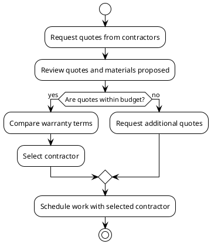

# Roof Replacement Options
- Overview of roof replacement options

<!-- notes: Welcome to the presentation on roof replacement options. -->

## Contractors and Quotes
- All Day Roofing & More LLC
  - FLAT ROOF TPO: $12,800.00
  - FLAT ROOF EPDM: $16,114.80
- BRAX Roofing
  - Full TPO Roof Replacement: $10,595.00
  - Optional Parapet Wall Installation: $3,625.00

<!-- notes: Here are the contractors who provided quotes and their respective prices. -->

## Materials Proposed
- All Day Roofing & More LLC
  - 60 Mil TPO
  - EPDM 75mill
  - RubberGard 90 mil EPDM
- BRAX Roofing
  - TPO membrane
  - 1” poly ISO insulation

<!-- notes: These are the materials proposed by each contractor for the roof replacement. -->

## Warranty Terms
- All Day Roofing & More LLC
  - TPO: 15-20 year warranty
  - EPDM: 20-30 year warranty
  - RubberGard 90 mil EPDM: 30-50 year warranty
- BRAX Roofing
  - 10-year workmanship warranty
  - 10-year manufacturer material warranty on the TPO roofing system

<!-- notes: These are the warranty terms provided by each contractor for their respective materials. -->

## Timeline
- Initial quote request: May 10, 2026
- Quote received: May 12, 2026
- Decision on contractor: TBD
- Scheduling work: TBD

<!-- notes: This slide outlines the timeline from the initial quote request to the decision on a contractor and scheduling of work. -->

## Decision Process Workflow

<!-- notes: This diagram shows the decision process from getting quotes to selecting a contractor to scheduling work. -->

## Conclusion
- Consider all options and make an informed decision
- Ensure warranties and timelines align with your needs

<!-- notes: Thank you for reviewing the presentation on roof replacement options. Make sure to consider all options and make an informed decision that aligns with your needs. -->