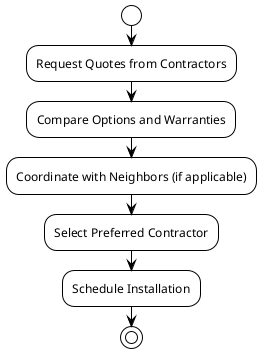

# Roof Replacement Options Overview

## Overview of Roof Replacement Options
- Options include TPO, Firestone, and EPDM materials
- Each contractor offers different warranties and pricing
- Timeline varies based on contractor availability
<!-- notes: This slide provides a high-level overview of the roof replacement options available. -->

## Contractor Comparison
### All Day Roofing & More LLC
- Option 1: TPO 15-20 year warranty, $12,800.00
- Option 2: EPDM 20-30 year warranty, $16,114.80
- Option 3: RubberGard 90 mil EPDM 30-50 year warranty, $20,996.04
<!-- notes: This slide lists the different options provided by All Day Roofing & More LLC, including warranties and costs. -->

### BRAX Roofing
- TPO membrane flat roof system with 1” poly ISO insulation
- 10-year workmanship warranty
- 10-year manufacturer material warranty
- Parapet wall option available for additional $3,625.00
<!-- notes: This slide details the BRAX Roofing proposal, including materials, warranties, and the optional parapet wall installation. -->

### American Home Contractors
- Virginia Roofing Corporation provides locked-in pricing upon delivery
- Includes removal of flashings, installation of new insulation and E.P.D.M. membrane, and base flashing
- Warranty terms and timeline specifics are provided upon request
<!-- notes: This slide presents the services and pricing from American Home Contractors, emphasizing the locked-in pricing and specific installation steps. -->

## Warranty Terms
- All Day Roofing & More LLC
  - Option 1: 15-20 year warranty
  - Option 2: 20-30 year warranty
  - Option 3: 30-50 year warranty
- BRAX Roofing
  - 10-year workmanship warranty
  - 10-year manufacturer material warranty
- American Home Contractors
  - Warranty details provided upon request
<!-- notes: This slide outlines the warranty terms offered by each contractor for reference. -->

## Timeline for Roof Replacement
- Initial Quote Request: 1-2 business days
- Approval and Coordination with Neighbors: 2-4 weeks
- Material Ordering: 1-2 weeks
- Installation Schedule: 3-5 days
<!-- notes: This slide provides a timeline for the roof replacement process from requesting quotes to the final installation. -->

## Decision Process Workflow

<!-- notes: This workflow diagram outlines the decision process from getting quotes to selecting a contractor and scheduling the work. -->