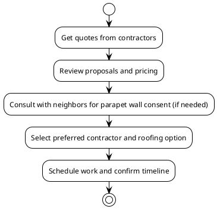

# Roof Replacement Options for Patrick Flanigan

- Overview of available options
- Key contractors and their proposals
- Pricing, materials, and warranty details
- Decision workflow diagram

<!-- notes: Welcome to this presentation on roof replacement options for Patrick Flanigan's property at 12133 Tribune Street, Fairfax, VA. -->

## Contractors and Proposals

- All Day Roofing & More LLC
  - 3060 Williams Dr, Suite 300 #505, Fairfax, VA 22031
  - Phone: (703) 627-0771
  - Representative: Daniel Nannucci, dnannucci@alldayroofingandmore.com
- BRAX Roofing
  - Recommended parapet wall installation
  - TPO membrane flat roof system with 1” poly ISO insulation
- American Home Contractors
  - 11820 W Market Place, Suite F, Fulton, MD 20759
  - Phone: (301) 209-7000
- Virginia Roofing Corporation
  - 800 South Pickett Street, Alexandria, VA 22304
  - Office: 703.751.3200

<!-- notes: Here are the key contractors who provided proposals for Patrick's roof replacement, along with their contact details and recommended solutions. -->

## Pricing and Materials

- All Day Roofing & More LLC
  - Option 1: TPO, 15-20 year warranty, $12,800
  - Option 2: EPDM, 20-30 year warranty, $16,114.80
  - Option 3: RubberGard EPDM, 30-50 year warranty, $20,996.04
- BRAX Roofing
  - Full TPO Roof Replacement: $10,595 (15% discount included)
  - Optional Parapet Wall Installation: Additional $3,625
- American Home Contractors
  - Roof Repairs: $2,850
- Virginia Roofing Corporation
  - .060 BLACK E.P.D.M. (rubber) roof recovery: Price not specified

<!-- notes: This slide outlines the pricing and materials proposed by each contractor, including warranty terms where available. -->

## Warranty Terms

- BRAX Roofing
  - 10-year workmanship warranty
  - 10-year manufacturer material warranty on TPO roofing system
- All Day Roofing & More LLC
  - Varies by option (15-20, 20-30, 30-50 years)
- American Home Contractors and Virginia Roofing Corporation
  - Warranty details not specified in source documents

<!-- notes: Warranty terms vary by contractor and roofing material. BRAX Roofing offers a 10-year workmanship and material warranty on their TPO system. -->

## Decision Workflow

<!-- notes: This diagram illustrates the decision workflow from obtaining quotes to selecting a contractor and scheduling the roof replacement work. -->

## Timeline

- Initial quote requests: May 2026
- Proposal reviews: May - June 2026
- Neighbor consultations: June 2026
- Contractor selection: June 2026
- Work scheduling: June - July 2026
- Expected completion: July 2026

<!-- notes: The expected timeline for the roof replacement project, from quote requests to completion, is outlined on this slide. -->

## Conclusion

- Multiple options available from reputable contractors
- Careful consideration of pricing, materials, and warranties
- Coordination with neighbors for parapet wall installation
- Clear decision workflow and timeline

<!-- notes: In conclusion, Patrick Flanigan has several viable options for his roof replacement, each with its own pricing, materials, and warranty terms. Careful consideration and coordination will ensure a successful project. -->