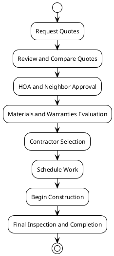

# Flanagan Residence Roof Replacement Options

<!-- notes: Welcome to the overview of roofing replacement options for the Flanagan residence at 12133 Tribune Street in Fairfax, Virginia. Today's presentation will cover contractor options, pricing, materials, warranties, and the workflow timeline. -->

## Contractors and Quotes

- **BRAX Roofing**: TPO roofing with parapet walls; $10,595 + $3,625 for parapet walls
- **All Day Roofing**: Three options including TPO and EPDM with pricing from $12,800 to $20,996
- **American Home Contractors**: Roof repair estimate at $2,850 for EPDM recovery

<!-- notes: Three contractors have submitted quotes for roof replacement or recovery. BRAX Roofing offers a TPO solution with an optional parapet wall structure. All Day Roofing provides three materials, including EPDM and TPO systems. American Home Contractors specializes in EPDM roof recovery at a lower estimate. -->

## Materials Proposed

- **TPO (Thermoplastic Olefin)**: Used by BRAX and All Day Roofing; lightweight, durable, energy efficient
- **EPDM (Ethylene Propylene Diene Monomer)**: Rubber roofing proposed by All Day Roofing and American Home Contractors; known for flexibility and longevity
- **Firestone Products**: Detailed in the BRAX proposal; TPO system with 20-year+ warranties

<!-- notes: Material choices include TPO membranes and EPDM rubber options. TPO is ideal for energy efficiency, while EPDM offers durability and flexibility. The BRAX proposal also mentions Firestone materials as part of their TPO system. -->

## Warranty Terms

- **BRAX Roofing**: 10-year workmanship and 10-year manufacturer material warranty on TPO
- **All Day Roofing**: Warranty ranges from 15-20 years on TPO up to 30-50 years on EPDM materials
- **Firestone Products**: Longevity and material quality backed by specific warranties in BRAX’s quote

<!-- notes: Warranty durations vary significantly based on material choice. TPO membranes from BRAX offer a 10-year warranty, while All Day Roofing provides longer-term EPDM warranties up to 30-50 years as per manufacturer claims. -->

## Timeline Overview

- **May 5-12, 2026**: Quotes received from BRAX, All Day, and American Home
- **May 12-20**: HOA and neighbor approval requested for structural modifications
- **May 20-28**: Final selections and contracts reviewed with contractors
- **June 2026**: Scheduling and material ordering begins
- **July 2026**: Estimated start of roofing work if approved

<!-- notes: The timeline shows the proposal timeline, pending approvals, and scheduling. Approval and coordination could extend or delay the process by a few weeks, but construction is expected to begin in early June. -->

## Workflow Diagram

<!-- notes: This flowchart illustrates the decision-making process from initial quote requests to final project completion, emphasizing important decision points such as approvals and evaluations. -->

## Summary and Key Considerations

- BRAX’s parapet wall option offers structural separation and future-proofing
- All Day Roofing provides a broader option set with longer EPDM warranties but higher cost
- American Home Contractors focuses on cost-effective repairs rather than full replacement
- HOA and neighbor approvals are critical, especially for structural modifications
- Material selection significantly affects pricing and long-term maintenance needs

<!-- notes: The choice comes down to cost, material life, and future maintenance freedom. The parapet wall option from BRAX offers long-term benefits in roof separation, while All Day’s EPDM is more costly but has a longer warranty. HOA approvals require careful coordination. -->

## Questions and Next Steps

- Finalize preferred contractor and roofing material following HOA and neighbor approvals
- Prepare formal documentation for the Centerpointe Homeowners Association and neighbors
- Coordinate with BRAX Roofing or All Day Roofing to submit revised proposals with diagrams and details
- Schedule inspections and begin construction in July 2026 if all approvals are granted

<!-- notes: The next steps include finalizing decisions and submitting formal approvals. If there are any questions or additional requirements, please reach out before May 20 to ensure timely scheduling and approvals. -->