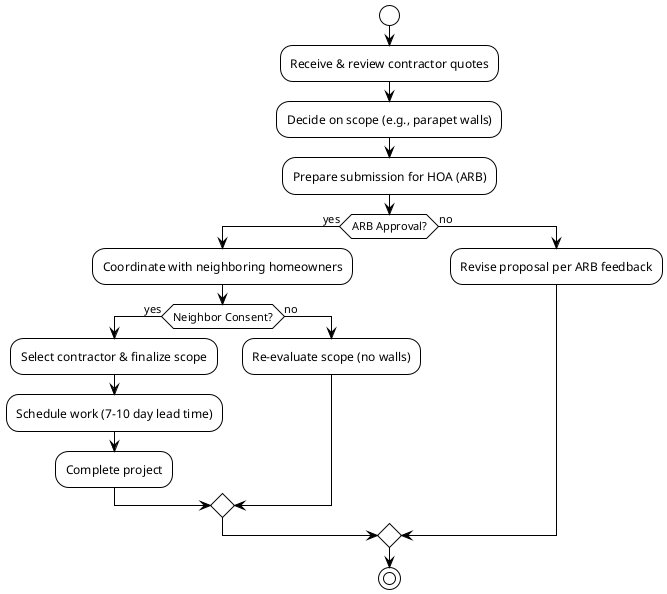

# Roof Replacement Options for Patrick Flanagan
- 12133 Tribune Street, Fairfax, VA 22033
<!-- notes: Welcome. This presentation details the proposals for replacing the flat roof at my property. -->

## Key Issue: Shared Roof System
- Current roof ties directly into both neighboring roofs
- Shared systems create long-term maintenance challenges
- Neighbors' roofs show age/wear, but no immediate failure
- BRAX recommends installing new parapet walls for separation
- Parapet walls require neighbor consent for tie-in coordination
<!-- notes: The primary challenge is the interconnected roof system, which complicates long-term ownership. -->

## Contractor & Proposal Overview
- **BRAX Roofing**: TPO system with optional parapet walls
- **All Day Roofing & More LLC**: Three material options (TPO, EPDM)
- **Virginia Roofing Corporation**: .060 black EPDM recovery system
- **American Home Contractors**: General roof repair estimate
- All Day Roofing's address: 3060 Williams Dr, Suite 300 #505, Fairfax, VA
<!-- notes: Four contractors have provided estimates with different material and scope approaches. -->

## Detailed Proposal Comparison
**BRAX Roofing**
- TPO membrane system, 1" poly ISO insulation
- Full replacement: $10,595.00 (15% discount applied)
- Optional parapet walls: Additional $3,625.00
- Warranty: 10-year workmanship, 10-year manufacturer material

**All Day Roofing & More LLC**
- Option 1 (60 mil TPO): $12,800.00, 15-20 year warranty
- Option 2 (75 mil EPDM): $16,114.80, 20-30 year warranty
- Option 3 (90 mil EPDM): $20,996.04, 30-50 year warranty
- Siding/Balcony Repair Add-on: $3,450.00
<!-- notes: BRAX focuses on separation, while All Day offers multiple material tiers with different warranties. -->

## Project Decision & Approval Workflow

<!-- notes: This diagram outlines the critical path, highlighting the need for HOA and neighbor approval. -->

## Critical Requirements & Timeline
- **HOA Approval Mandatory**: Centerpointe ARB requires written approval before any work
- Submit via Theoharis Management using "Exterior Modification Application"
- Work without approval risks immediate stop and restoration at homeowner's expense
- **Neighbor Coordination**: Required for parapet wall tie-in consent
- **Timeline**: After approvals, contractors typically schedule within 7-10 days (weather permitting)
- **Payment Terms**: Often require 50% deposit to order materials, 50% upon completion
<!-- notes: Navigating HOA rules and neighbor coordination is essential before scheduling any work. -->

## Summary & Recommended Next Steps
- BRAX's parapet wall solution addresses long-term separation concern
- Compare warranty lengths: 10 years (BRAX) vs. up to 50 years (All Day Option 3)
- Understand all potential added costs (wood repair, material price changes)
- First step: Prepare and submit ARB application with chosen scope
- BRAX offered to provide drawings/warranty sheets for HOA submission
- No rush; secure approvals before contractor scheduling
<!-- notes: I should decide on the scope, then formally seek HOA approval, using contractor-provided documents for support. -->